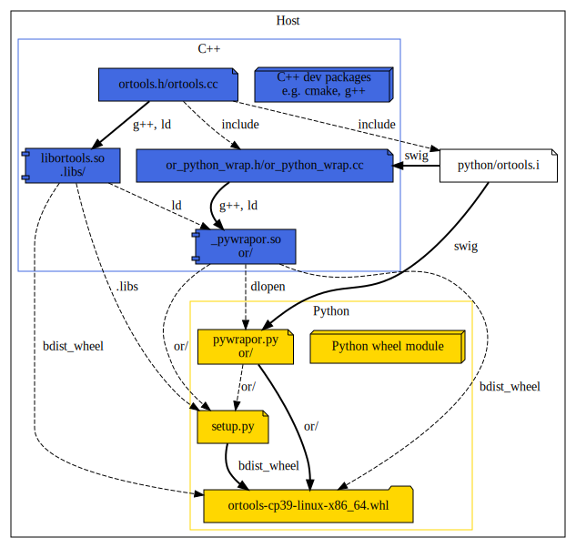
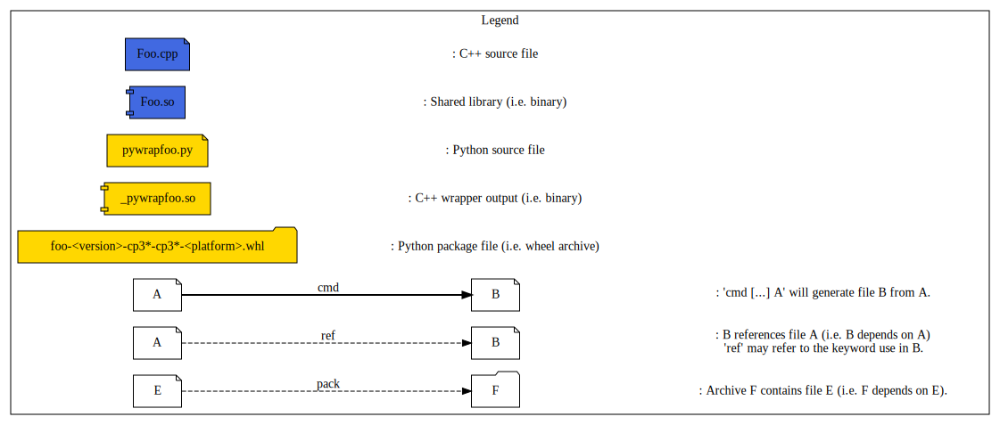

# Introduction

This is the documentation page for the Python 3.8+ wrapper of OR-Tools.

This project aim to explain how you build a Python native wheel package using
[`setup.py`](https://packaging.python.org/tutorials/packaging-projects/).

## Table of Content

* [Requirement](#requirement)
* [Directory Layout](#directory-layout)
* [Build Process](#build-process)
  * [Local Package](#local-package)
  * [Building a native Package](#building-local-native-package)
* [Appendices](#appendices)
  * [Resources](#resources)
* [Misc](#misc)

## Requirement

You'll need "Python >= 3.6" and few python modules ("wheel" and "absl-py").

## Directory Layout

* [setup.py.in](setup.py.in) `Setup.py` template to build the python native
  project.

## Build Process

To Create a native dependent package which will contains two parts:

* A bunch of native libraries for the supported platform targeted.
* The Python code depending on it.

note: Since [Pypi.org](https://pypi.org/) support multiple packages, we will
simply upload one package per supported platform.

### Local Package

The pipeline for `linux-x86-64` should be as follow: \
note: The pipeline will be similar for other architectures, don't hesitate to
look at the CI log! 


#### Building local native Package

Thus we have the C++ shared library `libortools.so` and the SWIG generated
Python wrappers e.g. `pywrapsat.py` in the same package.

Here some dev-note concerning this `setup.py`.

* This package is a native package containing native libraries.

Then you can generate the package and install it locally using:

```bash
python3 setup.py bdist_wheel
python3 -m pip install --user --find-links=dist ortools
```

If everything good the package (located in `<buildir>/python/dist`) should have
this layout:

```
{...}/dist/ortools-X.Y.9999-cp3Z-cp3Z-<platform>.whl:
\- ortools
   \- __init__.py
   \- .libs
      \- libortools.so
   \- constraint_solver
      \- __init__.py
      \- pywrapcp.py
      \- _pywrapcp.so
   \- ...
      \- __init__.py
      \- pywrap....py
      \- _pywrap....so
...
```
note: `<platform>` could be `manylinux2014_x86_64`, `macosx_10_9_x86_64` or `win-amd64`.

tips: since wheel package are just zip archive you can use `unzip -l <package>.whl`
to study their layout.

## Appendices

Few links on the subject...

### Resources

* [Packaging Python Project](https://packaging.python.org/tutorials/packaging-projects/)
* [PEP 513 -- A Platform Tag for Portable Linux Built Distributions](https://www.python.org/dev/peps/pep-0513/)
* [PEP 571 -- The manylinux2010 Platform Tag](https://www.python.org/dev/peps/pep-0571/)
* [PEP 600  Future 'manylinux' Platform Tags](https://www.python.org/dev/peps/pep-0600/)

## Misc

Image has been generated using [plantuml](http://plantuml.com/):

```bash
plantuml -Tsvg docs/{file}.dot
```
So you can find the dot source files in [docs](docs).
